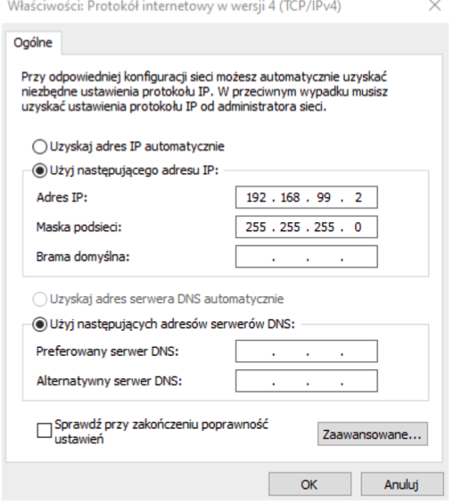

# Instrukcja połączenia z RaspberryPi Zero

## Konfiguracja sieci

Aby połączyć się z Raspberry Pi Zero za pomocą protokołu SSH należy podłączyć urządznenie do komputera za pomocą kabla micoUSB. 

Następnie przechodzimy do menadżera urządzeń, gdzie powinniśmy znaleźć z zakładce *Karty sieciowe* znaleźć urządzenie o nazwie **USB Ethernet/RNDIS Gadget**. Jeśli tak jest, oznacza to, że na tym komputerze zostały zainstalowane sterowniki. 

Proszę przejść do *Centrum sieci i udostępniania* a tam wybrać opcję *Zmień ustawienia karty*. 

Tam znajdujemy nasz kartę (nazwa jak w menedżerze urządzeń). 

Wchodzimy w jej właściwości, a następnie klikamy na *Protokół internetowy w wersji 4 (TCP/IPv4)* po czym klikamy w przycisk *Właściwości*. 

Dalej ustawiamy pola jak na poniższym obrazie i klikamy OK. 

Po tym kroku uruchamiamy wiersz poleceń i za pomocą instrukcji *ping 192.168.99.2* sprawdzamy połączenienie z komputerem. 

## Połączenie z komputerem 

Do połączenia z komputerem po SSH potrzebrne będą dwa programy *PyTTY* oraz *WinSCP*. 

W programie PuTTY wprowadzamy dane jak na rysunku poniżej i klikamy *Open* 

Zatwierdzamy ewentualne ostrzeżenie o certyfikacie. 

Powinna pojawić się konsola - logujemy się danymi: \
**login: pi**  
**hasło: raspberry**  

## Otwieranie portów 

### W pierwszej kolejności sprawdź jakie porty są otwarte na Raspberry Pi.
1. Otwórz terminal na Raspberry Pi.
2. Upewnij się, że narzędzie `nmap` jest zainstalowane. Jeśli nie jest zainstalowane, wpisz polecenie `sudo apt-get install nmap`, aby je zainstalować.
3. Wpisz polecenie `sudo nmap -p- localhost`, aby przeskanować wszystkie porty na lokalnym hoście (Raspberry Pi). Może to chwilę potrwać.
4. Po zakończeniu skanowania, otrzymasz wynik, który pokaże, które porty są otwarte na Raspberry Pi.
Przykładowy wynik może wyglądać tak:
     
        PORT     STATE SERVICE
        22/tcp   open  ssh
        80/tcp   open  http
        12345/tcp open  unknown

W powyższym przykładzie porty 22, 80 i 12345 są otwarte na Raspberry Pi.

### Otwieranie portów w Raspberry Pi
Aby otworzyć porty w Raspberry Pi do komunikacji po UDP, możesz skorzystać z narzędzia iptables, które jest wbudowane w większość dystrybucji systemu Linux, w tym Raspbian.
1. Otwórz terminal na Raspberry Pi.
2. Sprawdź, czy masz zainstalowane narzędzie iptables, wpisując polecenie `sudo iptables - L`.
Jeśli nie masz go zainstalowanego, możesz zainstalować go wpisując polecenie `sudo apt-get install iptables`.
3. Utwórz nowe zasady dla portu UDP, który chcesz otworzyć. Na przykład, jeśli chcesz otworzyć port 8803, wpisz poniższe polecenie w terminalu:
        
        sudo iptables -A INPUT -p udp --dport 8803 -j ACCEPT

    Powyższe polecenie dodaje nową zasadę do łańcucha INPUT, która akceptuje pakiety UDP przychodzące na porcie 8803.

        sudo iptables -A OUTPUT -p udp --sport 8803 -j ACCEPT 

    Powyższe polecenie dodaje nową zasadę do łańcucha OUTPUT, która akceptuje pakiety UDP wychodzące na porcie 8803.

4. Zapisz zmienione zasady iptables, aby były one stosowane po ponownym uruchomieniu Raspberry Pi. Możesz to zrobić, wpisując polecenie:

        sudo sh -c "iptables-save > /etc/iptables/rules.v4"

Powyższe polecenie zapisuje aktualne zasady iptables do pliku
`/etc/iptables/rules.v4`.

Jeżeli wyświetla się błąd, proszę zainstalować pakiet iptables- persistent:
`sudo apt-get install iptables-persistent`

## Sprawdzanie adresu IP 

Aby sprawdzic adres IP należy w terminalu Raspberry Pi Zero wykonać komendę: 
`ifconfig`. 

Interesujący na adres znajduje się w polu `usb0`. Proszę go skopiować. 

## Konfigurowanie kodu 

Aby mieć możliwość komunikacji z Raspberry Pi Zero za pomocą protokołu UDP należy w plikach `mag_measure.py` na Raspberry oraz `mag_read.py` na komputerze zmienić adresy IP oraz porty na odpowiednio wcześniej skopiowany adres IP i odblokowany port. 

    # udp clinet (listener) configuration
    # set own IP to bind -> Raspberry Pi
    UDP_IP_SELF = "169.254.133.53"
    UDP_PORT_SELF = 8803 

